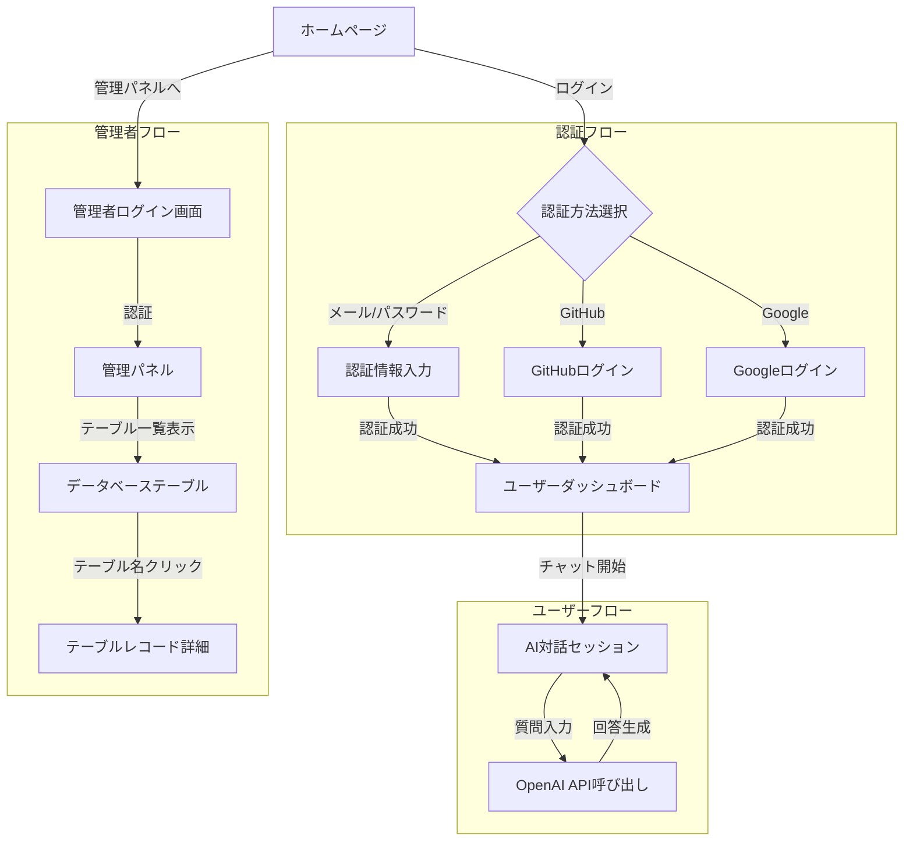

# AI統合型データ分析・管理ポートフォリオ

このプロジェクトは、最新のWeb技術、クラウドインフラ、生成AI、データサイエンス技術を統合した包括的なポートフォリオアプリケーションです。Next.js 15をベースに構築され、生成AIを活用したチャット機能、データベース管理機能、クラウドデプロイメントなどの機能を提供します。

## 主な機能

- **認証システム**: NextAuth.jsによるマルチプロバイダー認証（Email/Password, Google, GitHub）
- **生成AI対話**: OpenAIのAPIを使用した会話機能
- **管理パネル**: データベーステーブルの閲覧・管理機能
- **クラウドデプロイメント**: Azure上でのコンテナ化されたデプロイメント

## プロジェクト構造

```
.
├── src/                    # ソースコード
│   ├── app/                # Next.js App Router
│   │   ├── api/            # APIエンドポイント
│   │   ├── admin/          # 管理パネル
│   │   ├── auth/           # 認証関連ページ
│   │   └── chat/           # チャットアプリケーション
│   ├── components/         # 共通コンポーネント
│   ├── lib/                # ユーティリティとヘルパー
│   └── types/              # TypeScript型定義
├── prisma/                 # Prismaスキーマとマイグレーション
├── public/                 # 静的アセット
├── infra/                  # Terraformスクリプト
├── docs/                   # プロジェクトドキュメント
├── docker-compose.yml      # 開発環境設定
├── Dockerfile.dev          # 開発環境ビルド用
└── Dockerfile              # 本番ビルド用
```

## アプリケーション使用フロー



## 技術スタック

### フロントエンド
- **Next.js 15**: App Routerによる最新のReactフレームワーク
- **React 19**: コンポーネントベースUI
- **TypeScript**: 型安全なコーディング
- **TailwindCSS**: モダンなスタイリング

### バックエンド
- **Next.js API Routes**: RESTful APIエンドポイント
- **Prisma ORM**: タイプセーフなデータベースアクセス
- **PostgreSQL**: リレーショナルデータベース
- **NextAuth.js**: 認証フレームワーク

### AI / データサイエンス
- **OpenAI API**: GPT-4等のLLMを使用した生成AI機能

### インフラストラクチャ
- **Docker**: アプリケーションのコンテナ化
- **Terraform**: インフラストラクチャのコード化（IaC）
- **Azure**: クラウドデプロイメント
  - Container Registry
  - App Service
  - PostgreSQL Flexible Server

## ローカル開発環境のセットアップ

### 前提条件
- Docker と Docker Compose
- Node.js 18以上
- npm または yarn
- Git


