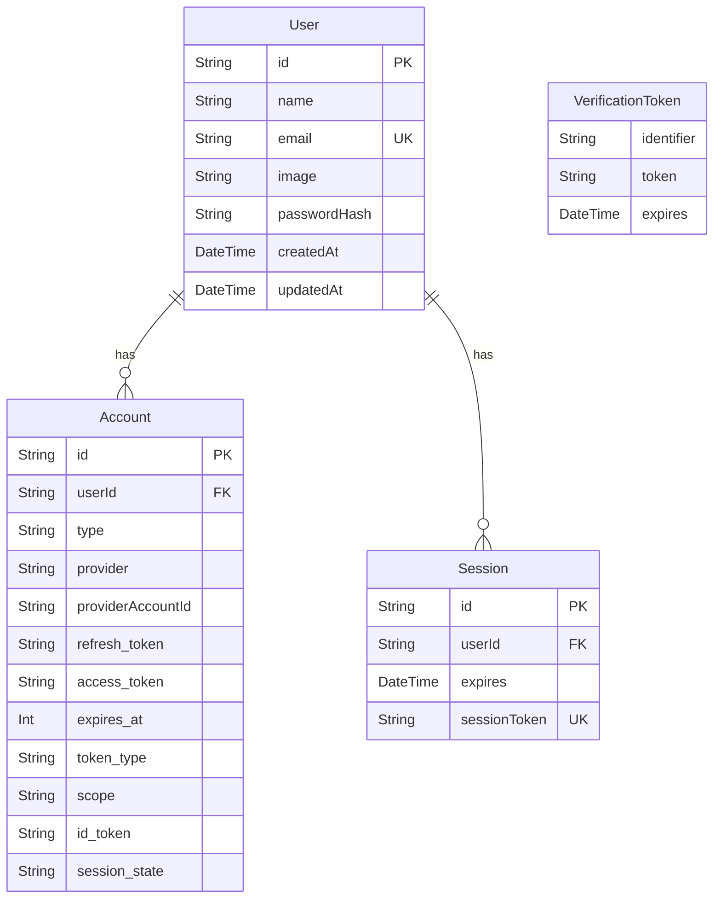
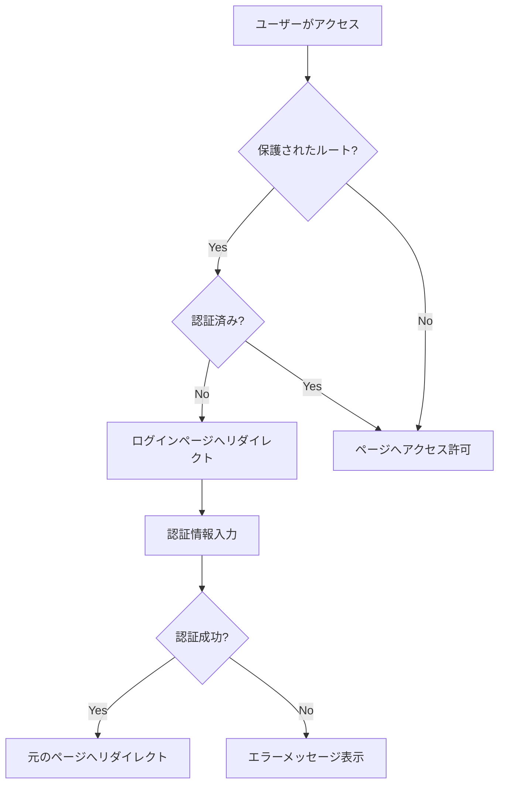
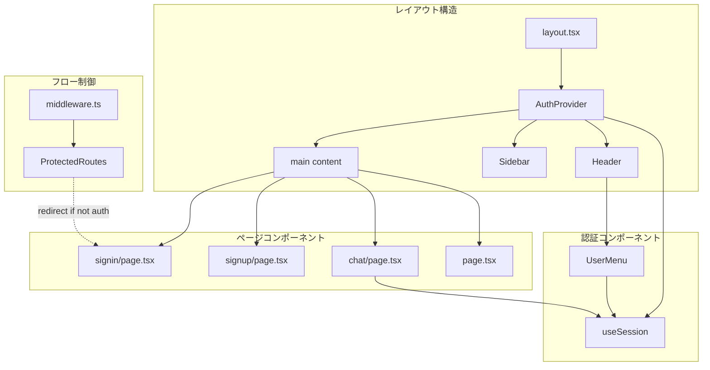
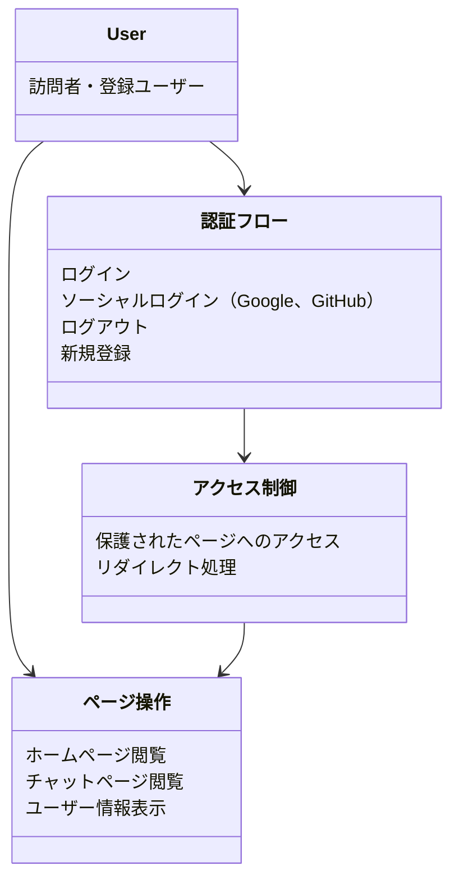

# Next.js認証機能の実装と改善：認証リダイレクトとアクセス制御

このドキュメントでは、Next.jsアプリケーションにおける認証機能の実装と、特に認証リダイレクトとアクセス制御に関する改善について詳しく説明します。

## 1. 実装の概要

Next.jsアプリケーションに以下の機能を実装・改善しました：

1. 認証後のリダイレクト機能
2. 保護されたルートへのアクセス制御
3. サイドバーとヘッダーの最適化
4. ユーザープロフィール画像の表示改善
5. 画面サイズに合わせたレイアウト最適化

## 2. インストールしたパッケージ

```json
{
  "dependencies": {
    "@auth/prisma-adapter": "^2.8.0",
    "@prisma/client": "^6.5.0",
    "bcrypt": "^5.1.1",
    "next": "15.2.2",
    "next-auth": "^4.24.11",
    "prisma": "^6.5.0",
    "react": "^19.0.0",
    "react-dom": "^19.0.0"
  }
}
```

主な認証関連パッケージ：
- **next-auth**: 認証機能全般を提供
- **@auth/prisma-adapter**: NextAuthとPrismaを連携させるアダプター
- **bcrypt**: パスワードハッシュ化に使用

## 3. 実行したコマンド

### 3.1 パッケージのインストール
```bash
# 不足していた@auth/prisma-adapterをインストール
docker exec -it my-next-app-app-1 npm uninstall @next-auth/prisma-adapter
docker exec -it my-next-app-app-1 npm install @auth/prisma-adapter@^2.8.0

# Dockerコンテナ内で一般的なnpmコマンド実行例
docker exec -it my-next-app-app-1 npm install      # 全パッケージのインストール
docker exec -it my-next-app-app-1 npm ci           # package-lock.jsonに基づく厳密なインストール
docker exec -it my-next-app-app-1 npm run build    # ビルドスクリプト実行
docker exec -it my-next-app-app-1 npm run dev      # 開発サーバー起動
docker exec -it my-next-app-app-1 npm list         # インストール済みパッケージ一覧表示
docker exec -it my-next-app-app-1 npm cache clean --force  # npmキャッシュクリア
```

### 3.2 Prisma関連コマンド
```bash
# Dockerコンテナ内でのPrismaコマンド実行例

# Prismaプロジェクトの初期化
docker exec -it my-next-app-app-1 npx prisma init

# データベーススキーマの生成（既存DBからリバースエンジニアリング）
docker exec -it my-next-app-app-1 npx prisma db pull

# スキーマをデータベースに適用（開発環境向け）
docker exec -it my-next-app-app-1 npx prisma db push

# マイグレーションファイルの作成と適用
docker exec -it my-next-app-app-1 npx prisma migrate dev --name init

# 本番環境へのマイグレーション適用
docker exec -it my-next-app-app-1 npx prisma migrate deploy

# Prismaクライアントの生成
docker exec -it my-next-app-app-1 npx prisma generate

# Prisma Studioの起動（データベースGUI）
docker exec -it my-next-app-app-1 npx prisma studio

# データベースのシード（初期データ投入）
docker exec -it my-next-app-app-1 npx prisma db seed

# スキーマの検証
docker exec -it my-next-app-app-1 npx prisma validate

# NextAuthのスキーマ（今回使用したモデル）
# prisma/schema.prisma の内容例
model User {
  id            String    @id @default(cuid())
  name          String?
  email         String?   @unique
  emailVerified DateTime?
  image         String?
  passwordHash  String?
  accounts      Account[]
  sessions      Session[]
}

model Account {
  id                String  @id @default(cuid())
  userId            String
  type              String
  provider          String
  providerAccountId String
  refresh_token     String? @db.Text
  access_token      String? @db.Text
  expires_at        Int?
  token_type        String?
  scope             String?
  id_token          String? @db.Text
  session_state     String?

  user User @relation(fields: [userId], references: [id], onDelete: Cascade)

  @@unique([provider, providerAccountId])
}

model Session {
  id           String   @id @default(cuid())
  sessionToken String   @unique
  userId       String
  expires      DateTime
  user         User     @relation(fields: [userId], references: [id], onDelete: Cascade)
}

model VerificationToken {
  identifier String
  token      String   @unique
  expires    DateTime

  @@unique([identifier, token])
}
```

### 3.3 Docker関連コマンド
```bash
# アプリケーションの再起動
docker-compose restart app

# 完全なリビルド
docker-compose down && docker-compose up -d

# コンテナログの確認
docker-compose logs -f app
docker-compose logs -f db

# データベースコンテナへの接続（SQL実行用）
docker exec -it my-next-app-db-1 psql -U postgres -d nextauth
```

### 3.4 PostgreSQLのDocker利用

```yaml
# docker-compose.yml (PostgreSQL関連部分)
services:
  db:
    image: postgres:15
    restart: always
    environment:
      POSTGRES_USER: postgres
      POSTGRES_PASSWORD: postgres
      POSTGRES_DB: nextauth
    volumes:
      - postgres_data:/var/lib/postgresql/data
    ports:
      - "5432:5432"
    healthcheck:
      test: ["CMD-SHELL", "pg_isready -U postgres"]
      interval: 5s
      timeout: 5s
      retries: 5

volumes:
  postgres_data:
```

主なPostgreSQLの利用ポイント：
- **コンテナ分離**: アプリケーションとデータベースが分離されたコンテナで実行
- **永続化データ**: `postgres_data`ボリュームでデータを永続化
- **環境変数**: データベース名、ユーザー名、パスワードを環境変数で設定
- **ヘルスチェック**: データベースの準備状態を確認するヘルスチェック
- **Prisma接続**: 以下の接続文字列でPrismaからPostgreSQLに接続

```
# .env内の設定例
DATABASE_URL="postgresql://postgres:postgres@db:5432/nextauth?schema=public"
```

本番環境では、セキュリティを強化するために以下の対策を推奨：
- 強力なパスワードの使用
- ネットワークアクセス制限
- データの暗号化
- レプリケーションによる冗長性確保

### 3.5 Docker開発ワークフロー

ファイルやパッケージを変更してDocker環境に反映させる際の一般的な手順は以下の通りです：

#### ファイル編集の反映方法

1. **ボリュームマウントを活用した開発**
   ```yaml
   # docker-compose.yml (アプリケーション部分)
   services:
     app:
       # ...その他の設定
       volumes:
         - .:/app  # ホストのカレントディレクトリをコンテナの/appにマウント
   ```
   このように設定することで、ホスト側でファイルを編集すると即座にコンテナ内に反映されます。

2. **変更の反映方法**
   - **Next.jsの開発モード（ホットリロード対応）**: 基本的にファイル編集だけで自動的に反映されます
   - **フロントエンド (CSS/TSX/JSX)**: 通常は保存するだけで自動的に反映されます
   - **バックエンド (API)**: 変更後、以下のコマンドでサーバーを再起動
     ```bash
     docker-compose restart app
     ```
   - **設定ファイル (.env等)**: 変更後にコンテナを再起動する必要があります
     ```bash
     docker-compose down && docker-compose up -d
     ```

#### パッケージの追加・更新

1. **新しいパッケージのインストール**
   ```bash
   # パッケージの追加
   docker exec -it my-next-app-app-1 npm install パッケージ名

   # 開発用パッケージの追加
   docker exec -it my-next-app-app-1 npm install --save-dev パッケージ名
   ```

2. **依存関係の更新後のステップ**
   ```bash
   # Prisma関連パッケージを更新した場合
   docker exec -it my-next-app-app-1 npx prisma generate
   
   # package.jsonを大幅に変更した場合
   docker-compose down
   docker-compose build --no-cache app  # イメージを再ビルド
   docker-compose up -d
   ```

#### データベース関連の変更

1. **スキーマ変更の反映**
   ```bash
   # schema.prismaを修正後
   docker exec -it my-next-app-app-1 npx prisma generate  # クライアント再生成
   docker exec -it my-next-app-app-1 npx prisma db push   # 開発環境のDBに反映
   
   # 本格的なマイグレーション
   docker exec -it my-next-app-app-1 npx prisma migrate dev --name 変更内容
   ```

2. **データベースのリセット（開発時のみ）**
   ```bash
   docker exec -it my-next-app-app-1 npx prisma migrate reset
   ```

#### 開発環境の一般的なワークフロー

1. **開発環境の立ち上げ**
   ```bash
   # 初回起動
   docker-compose up -d
   
   # DB接続確認
   docker-compose logs db | grep "database system is ready"
   
   # マイグレーション実行
   docker exec -it my-next-app-app-1 npx prisma migrate dev
   ```

2. **変更を加えるサイクル**
   - ホスト側でコードを編集
   - 必要に応じてパッケージをインストール
   - 必要に応じてコンテナを再起動
   - ブラウザで確認（通常 http://localhost:3000）

3. **トラブルシューティング**
   ```bash
   # ログの確認
   docker-compose logs -f app
   
   # コンテナ内部でのデバッグ
   docker exec -it my-next-app-app-1 /bin/bash
   
   # コンテナの状態確認
   docker-compose ps
   
   # キャッシュクリアとコンテナの完全な再構築
   docker-compose down
   docker system prune -f --volumes  # 注意: すべてのキャッシュとボリュームが削除されます
   docker-compose up -d --build
   ```

4. **本番環境向けビルド検証**
   ```bash
   # ビルドテスト
   docker exec -it my-next-app-app-1 npm run build
   
   # 本番モードでのアプリケーション実行
   docker exec -it my-next-app-app-1 npm start
   ```

以上の手順で、Docker環境を活用したNext.jsアプリケーションの開発ワークフローを効率的に実践できます。ホットリロードやボリュームマウントを活用することで、コンテナを頻繁に再起動せずに開発を進められます。

## 4. ディレクトリ構造

```
src/
├── app/
│   ├── api/
│   │   └── auth/
│   │       └── [...nextauth]/
│   │           └── route.ts      # NextAuth.js設定とリクエスト処理
│   │   ├── auth/
│   │   │   ├── signin/
│   │   │   │   └── page.tsx          # サインインページ
│   │   │   ├── signup/
│   │   │   │   └── page.tsx          # サインアップページ
│   │   │   └── signout/
│   │   │       └── page.tsx          # サインアウトページ
│   │   ├── chat/
│   │   │   └── page.tsx              # 保護されたチャットページ
│   │   ├── layout.tsx                # アプリケーションのレイアウト
│   │   └── page.tsx                  # トップページ
│   ├── components/
│   │   ├── AuthProvider.tsx          # 認証状態を提供するプロバイダー
│   │   ├── Header.tsx                # ヘッダーコンポーネント
│   │   ├── Sidebar.tsx               # サイドバーコンポーネント
│   │   └── UserMenu.tsx              # ユーザーメニューコンポーネント
│   └── middleware.ts                 # アクセス制御のミドルウェア
```

## 5. データベース設計（ER図）



## 6. 認証フロー図



## 7. コンポーネント関連図



## 8. ユースケース図



## 9. 実装の詳細

### 9.1 ミドルウェアによるアクセス制御

```typescript
// src/middleware.ts
import { NextRequest, NextResponse } from 'next/server';
import { getToken } from 'next-auth/jwt';

// 保護するパス
const protectedPaths = ['/chat'];

// 公開パス
const publicPaths = ['/', '/auth/signin', '/auth/signup', '/auth/signout', '/api/auth'];

export async function middleware(request: NextRequest) {
    const path = request.nextUrl.pathname;
    
    // API ルートや静的ファイルは無視
    if (
        path.startsWith('/_next') || 
        path.startsWith('/api/') ||
        path.startsWith('/static/') ||
        path.includes('.')
    ) {
        return NextResponse.next();
    }

    // 常に公開されているパスはスキップ
    if (publicPaths.some(p => path === p || path.startsWith(p + '/'))) {
        return NextResponse.next();
    }

    const token = await getToken({ 
        req: request,
        secret: process.env.NEXTAUTH_SECRET
    });

    // 保護されたパスにアクセスしようとしていて、認証されていない場合
    if (protectedPaths.some(p => path === p || path.startsWith(p + '/')) && !token) {
        // ログインページにリダイレクト
        const url = new URL('/auth/signin', request.url);
        url.searchParams.set('callbackUrl', encodeURI(request.url));
        return NextResponse.redirect(url);
    }

    return NextResponse.next();
}
```

### 9.2 サインインページのリダイレクト機能

```typescript
// src/app/auth/signin/page.tsx (一部抜粋)
'use client';

import { signIn } from 'next-auth/react';
import { useState } from 'react';
import { useSearchParams } from 'next/navigation';

export default function SignIn() {
    // callbackUrlの取得
    const searchParams = useSearchParams();
    const callbackUrl = searchParams?.get('callbackUrl') || '/';
    
    // 認証処理にcallbackUrlを渡す
    const handleCredentialsLogin = async (e: React.FormEvent) => {
        // ...
        const result = await signIn('credentials', {
            redirect: false,
            email,
            password,
            callbackUrl
        });
        
        if (!result?.error && result?.url) {
            window.location.href = result.url;
        }
        // ...
    };
    
    // ソーシャルログインでもcallbackUrlを使用
    const handleGoogleSignIn = async () => {
        await signIn('google', { callbackUrl });
    };
}
```

### 9.3 保護されたチャットページ

```typescript
// src/app/chat/page.tsx
'use client';

import { useSession } from 'next-auth/react';
import { useRouter } from 'next/navigation';

export default function ChatPage() {
    const { data: session, status } = useSession();
    const router = useRouter();

    // クライアントサイドでの認証チェック
    useEffect(() => {
        if (status === 'unauthenticated') {
            router.push('/auth/signin?callbackUrl=' + encodeURIComponent('/chat'));
        }
    }, [status, router]);
    
    // 未認証状態の表示制御
    if (status === 'loading') {
        return <div>ロード中...</div>;
    }
    
    if (!session) {
        return null;
    }
    
    // 認証済みユーザーにのみ表示されるコンテンツ
    return (
        <div>
            <h1>チャット</h1>
            {/* チャットコンテンツ */}
        </div>
    );
}
```

## 10. 技術的ポイント

1. **二重の保護レイヤー**:
   - サーバーサイドミドルウェアによる保護
   - クライアントサイドでのセッションチェック

2. **リダイレクトの最適化**:
   - 元の URL を callbackUrl として保持
   - ログイン後に適切なページに戻る

3. **レイアウトのコンポーネント化**:
   - ヘッダー、サイドバー、ユーザーメニューを分離
   - 再利用可能なコンポーネント設計

4. **UX の改善**:
   - ローディング状態の表示
   - エラーメッセージのわかりやすい表示
   - 画面サイズに適応するレスポンシブデザイン

## 11. 今後の展望

1. **認証機能の拡張**:
   - 二要素認証の追加
   - パスワードリセットの実装
   - ロール・権限システムの導入

2. **UIの改善**:
   - ダークモードの実装
   - アニメーションの追加
   - アクセシビリティの向上

3. **セキュリティ強化**:
   - CSRFトークンの実装
   - レート制限の導入
   - セキュリティヘッダーの設定

## 12. 参考資料

- [NextAuth.js 公式ドキュメント](https://next-auth.js.org/)
- [Next.js ミドルウェア](https://nextjs.org/docs/app/building-your-application/routing/middleware)
- [Prisma 公式ドキュメント](https://www.prisma.io/docs) 