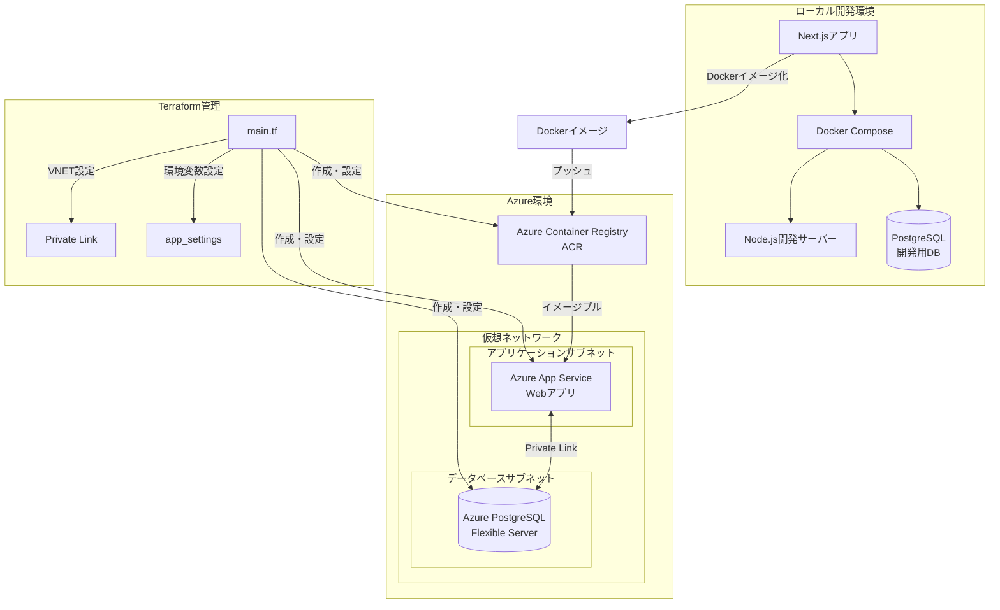
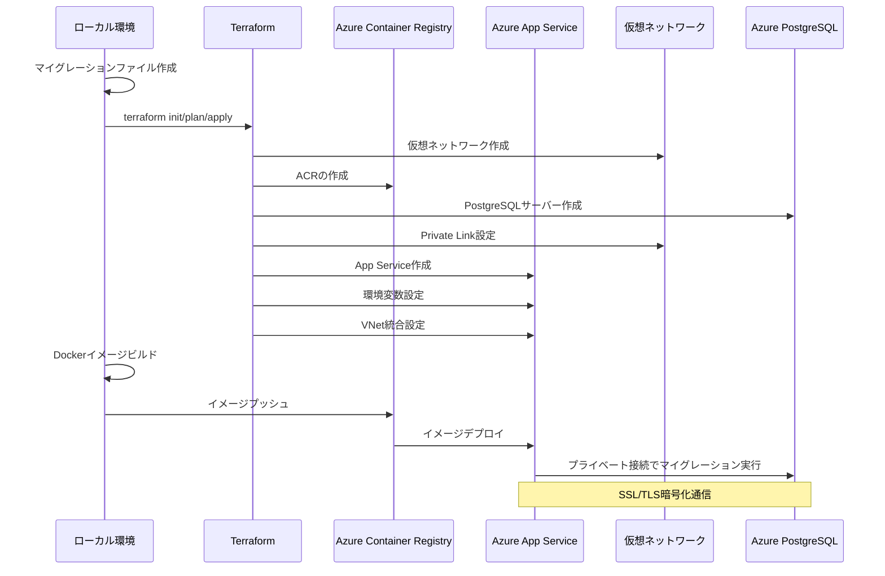

# Azure環境へのログイン認証機能のデプロイ手順

このドキュメントでは、Next.jsアプリケーションのログイン認証機能をAzure環境にデプロイする手順を説明します。

## 実施した作業の時系列

1. **データベースマイグレーションの準備** (2024/03/XX)
   ```bash
   # ローカルDBの起動
   docker compose up -d db
   
   # マイグレーションファイルの作成
   npx prisma migrate reset --force
   npx prisma migrate dev --name init
   
   # マイグレーションファイルのコミット
   git add prisma/migrations/*
   git commit -m "Add initial database migrations"
   ```

2. **Terraformによるインフラ構築** (2024/03/XX)
   ```bash
   # インフラのプロビジョニング
   cd ./infra
   terraform init
   terraform plan -out tfplan
   terraform apply "tfplan"
   ```
   - ACR、PostgreSQL、App Serviceの作成
   - 環境変数の設定（NODE_ENV=production含む）
   - データベース接続情報の設定

3. **Dockerイメージのビルドとデプロイ** (2024/03/XX)
   ```bash
   # イメージのビルド
   docker build -t mynextappacr.azurecr.io/my-next-app:latest .
   
   # ACRへのログインとプッシュ
   az acr login --name mynextappacr
   docker push mynextappacr.azurecr.io/my-next-app:latest
   ```

4. **アプリケーションの再起動とデプロイ確認** (2024/03/XX)
   ```bash
   # Webアプリの再起動
   az webapp restart --name my-nextapp-web --resource-group my-nextapp-rg
   
   # ログの確認
   az webapp log tail --name my-nextapp-web --resource-group my-nextapp-rg
   ```

5. **動作確認** (2024/03/XX)
   - アプリケーションの起動確認
   - データベースマイグレーションの実行確認
   - メールアドレスでの新規登録機能の確認
   - ログイン機能の動作確認

## システム構成とデプロイフロー

### 開発環境とAzure環境の関係


### デプロイフロー


## 前提条件

- Azure CLIがインストールされていること
- Terraformがインストールされていること
- Dockerがインストールされていること
- Node.jsがインストールされていること

## 1. データベースマイグレーションの準備

### 1.1 ローカル環境でのマイグレーションファイル作成
```bash
# ローカルのPostgreSQLを起動
docker compose up -d db

# マイグレーションファイルの作成
npx prisma migrate reset --force
npx prisma migrate dev --name init

# 作成されたマイグレーションファイルをコミット
git add prisma/migrations/*
git commit -m "Add initial database migrations"
```

## 2. Terraformによるインフラ構築

### 2.1 Terraformの初期化と実行
```bash
cd ./infra
terraform init
terraform plan -out tfplan
terraform apply "tfplan"
```

### 2.2 主要なTerraform設定
- Azure Container Registry (ACR)
- Azure App Service Plan (Linux)
- Azure PostgreSQL Flexible Server
- Azure Web App (コンテナ用)

### 2.3 環境変数の設定
Terraformで以下の環境変数を設定：
```hcl
app_settings = {
  "NODE_ENV" = "production"
  "NEXTAUTH_URL" = "https://${var.webapp_name}.azurewebsites.net"
  "NEXTAUTH_SECRET" = var.nextauth_secret
  "DATABASE_URL" = "postgresql://${var.db_admin_username}:${urlencode(var.db_admin_password)}@${azurerm_postgresql_flexible_server.db.fqdn}:5432/nextauth?sslmode=disable"
  "GITHUB_ID" = var.github_id
  "GITHUB_SECRET" = var.github_secret
  "GOOGLE_CLIENT_ID" = var.google_client_id
  "GOOGLE_CLIENT_SECRET" = var.google_client_secret
}
```

## 3. Dockerイメージのビルドとデプロイ

### 3.1 Dockerイメージのビルド
```bash
docker build -t mynextappacr.azurecr.io/my-next-app:latest .
```

### 3.2 Azure Container Registryへのプッシュ
```bash
# ACRへのログイン
az acr login --name mynextappacr

# イメージのプッシュ
docker push mynextappacr.azurecr.io/my-next-app:latest
```

### 3.3 Webアプリケーションの再起動
```bash
az webapp restart --name my-nextapp-web --resource-group my-nextapp-rg
```

## 4. デプロイ後の確認

### 4.1 ログの確認
```bash
az webapp log tail --name my-nextapp-web --resource-group my-nextapp-rg
```

### 4.2 確認項目
- アプリケーションが正常に起動していること
- データベースマイグレーションが実行されていること
- ログイン・新規登録機能が動作すること
- OAuth認証（GitHub, Google）が機能すること

## 5. トラブルシューティング

### 5.1 データベース接続の問題
- PostgreSQLサーバーのファイアウォール設定を確認
- 接続文字列のフォーマットを確認
- SSLモードの設定を確認

### 5.2 アプリケーションの問題
- Webアプリのログを確認
- 環境変数が正しく設定されているか確認
- コンテナの起動状態を確認

## 6. セキュリティ考慮事項

### 6.1 SSL/TLS設定
- 本番環境では適切なSSL/TLS設定を実施済み
- データベース接続はSSL/TLS通信を強制（TLS 1.2以上）
- WebアプリはHTTPS通信を強制
- 安全な暗号スイートのみを使用

### 6.2 Private Link構成
- Azure Private Linkを使用し、仮想ネットワーク内での通信を確保
- PostgreSQLサーバーへの接続はプライベートエンドポイント経由
- 外部からのアクセスを制限し、パブリックネットワークからの接続を防止
- Virtual Network統合によるプライベート通信の確保

### 6.3 機密情報の管理
- 機密情報（APIキーなど）は安全に管理
- Terraformの変数として保存し、tfvarsファイルはバージョン管理から除外
- KeyVaultなどのシークレット管理サービスの利用を検討

### 6.4 定期的なバックアップとモニタリング
- データベースの自動バックアップを設定（7日間保持）
- アプリケーションとデータベースのメトリクス監視
- セキュリティログの収集と分析

## 7. 運用とメンテナンス

### 7.1 定期的な更新
- セキュリティアップデートの適用
- 依存パッケージの更新
- インフラストラクチャのメンテナンス

### 7.2 監視
- アプリケーションの健全性チェック
- リソース使用率の監視
- エラーログの監視

## 8. セキュリティチェック

### 8.1 SSLセキュリティチェック
以下のコマンドを使用して、SSL/TLS設定の安全性を検証します：

```bash
# SSLLabsを使用したSSLチェック
curl -s https://api.ssllabs.com/api/v3/analyze?host=my-nextapp-web.azurewebsites.net

# OpenSSLを使用した接続確認
openssl s_client -connect my-nextapp-web.azurewebsites.net:443 -tls1_2

# Nmap SSLスキャン
nmap --script ssl-enum-ciphers -p 443 my-nextapp-web.azurewebsites.net
```

### 8.2 セキュリティスキャナー
定期的にセキュリティスキャンを実行してください：

```bash
# AzureネイティブなセキュリティチェックツールMicrosoft Defender for Cloud
az security assessment list --resource-group my-nextapp-rg

# ZAPを使用したWebアプリケーションスキャン
docker run -t owasp/zap2docker-stable zap-baseline.py -t https://my-nextapp-web.azurewebsites.net
```

### 8.3 Private Link接続確認
Private Link接続が正しく機能しているかを確認します：

```bash
# Private DNS解決の確認
az network private-dns record-set list --resource-group my-nextapp-rg --zone-name privatelink.postgres.database.azure.com

# プライベートエンドポイント接続情報の表示
az network private-endpoint show --name my-nextapp-db-server-endpoint --resource-group my-nextapp-rg
```

---

このデプロイ手順は、Terraformを使用してAzureリソースを管理し、コンテナ化されたNext.jsアプリケーションをデプロイする方法を示しています。環境変数の管理、データベースマイグレーション、セキュリティ設定など、本番環境で必要な要素を含んでいます。 