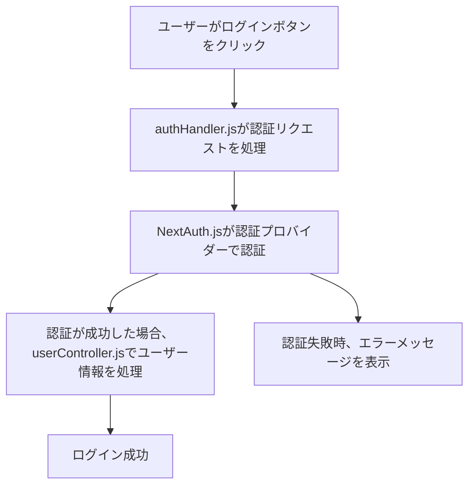
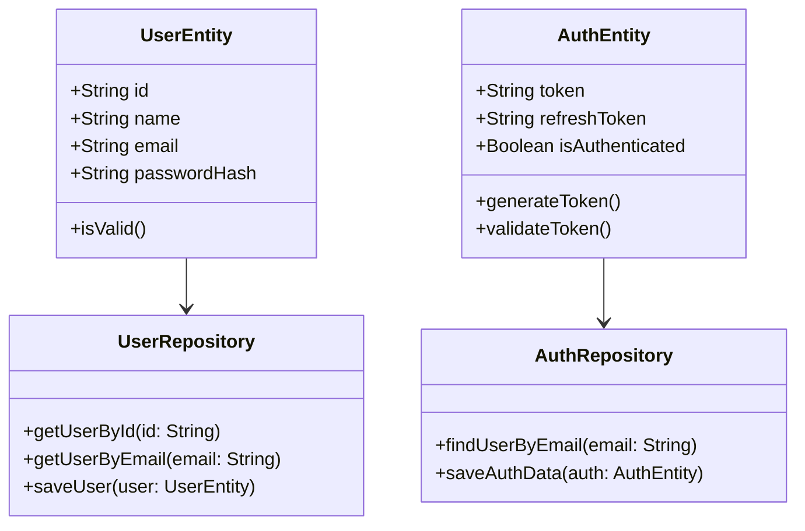
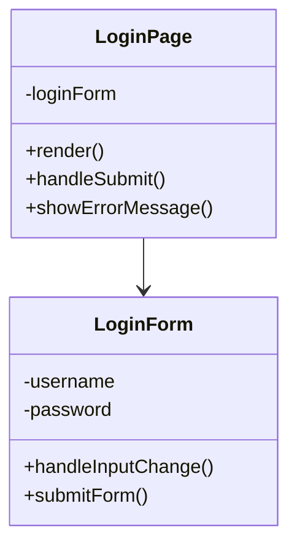
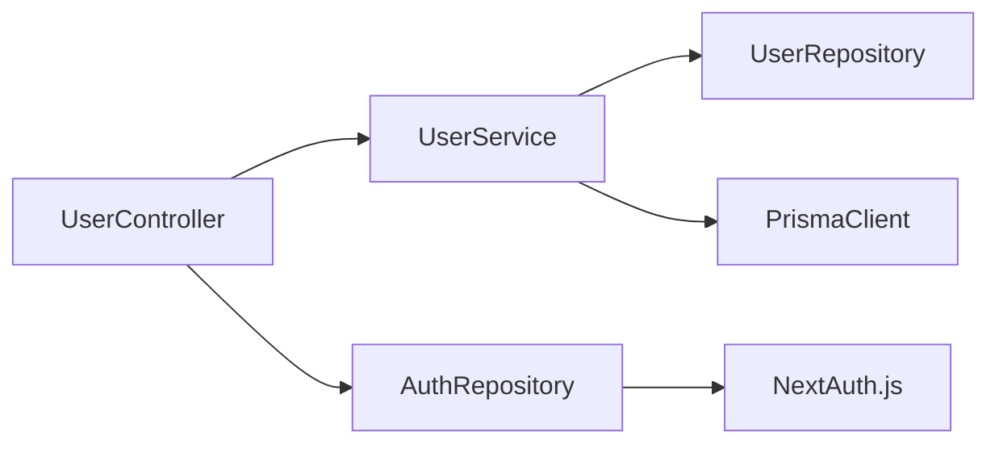
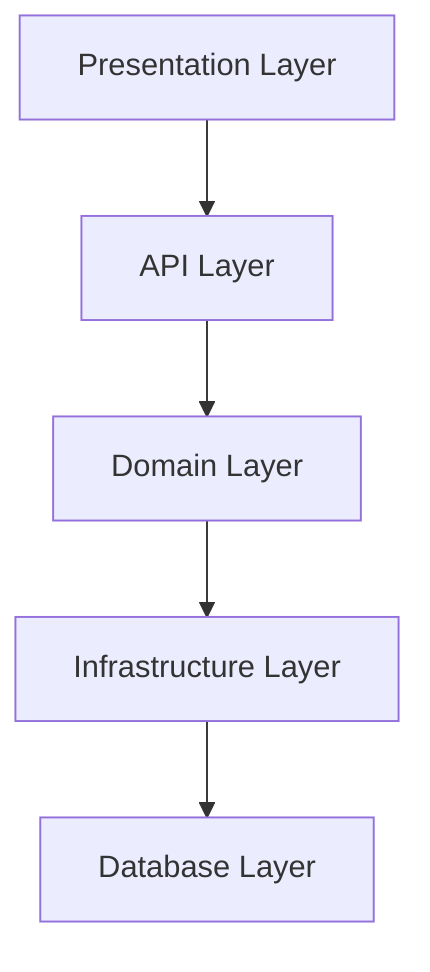

以下は、Next.jsアプリケーションにおけるバックエンドの処理をドメイン駆動設計に基づいて構築した際のディレクトリ構造です。この構造は、NextAuth.js、PostgreSQL、Prismaを使用したログイン機能に基づいています。

### ディレクトリ構造：
```
src/
├── api/
│   ├── auth/
│   │   ├── authHandler.js        # Handles authentication requests and NextAuth.js config
│   │   ├── loginController.js    # Handles login logic
│   │   └── logoutController.js   # Handles logout logic
│   └── user/
│       ├── userController.js     # Handles user-related actions
│       └── userService.js        # Business logic for user actions
├── domain/
│   ├── user/
│   │   ├── userEntity.js         # Represents the user entity
│   │   └── userRepository.js     # Interface for data access related to users
│   └── auth/
│       ├── authEntity.js         # Represents the auth entity
│       └── authRepository.js     # Interface for managing authentication
├── infrastructure/
│   ├── prisma/
│   │   ├── prismaClient.js       # Prisma client for database interaction
│   │   └── models/
│   │       ├── userModel.js      # Prisma schema for the user model
│   │       └── authModel.js      # Prisma schema for the auth model
└── presentation/
    └── auth/
        ├── loginPage.js          # Login page component
        └── logoutPage.js         # Logout page component
README.md                       # Project documentation
```

### 次に、処理のフロー図、ユースケース図、クラス設計・コンポーネント設計・モジュール設計・アーキテクチャ設計をMermaid記法で示します。

---

#### 1. 処理フロー図 (ログイン処理)



---

#### 2. ユースケース図

```mermaid
usecaseDiagram
    actor User as "ユーザー"
    actor Admin as "管理者"

    User --> (ログイン)
    User --> (ログアウト)
    Admin --> (ユーザー管理)
    (ログイン) --> (認証)
    (ログアウト) --> (セッション破棄)
```

---

#### 3. クラス設計



---

#### 4. コンポーネント設計 (ログインページ)



---

#### 5. モジュール設計



---

#### 6. アーキテクチャ設計 (レイヤー構造)



---

これらの設計を通じて、Next.jsを利用したドメイン駆動設計のログイン機能がどのように組織化され、どのコンポーネントやモジュールがどのように相互作用するかがわかりやすく示されています。